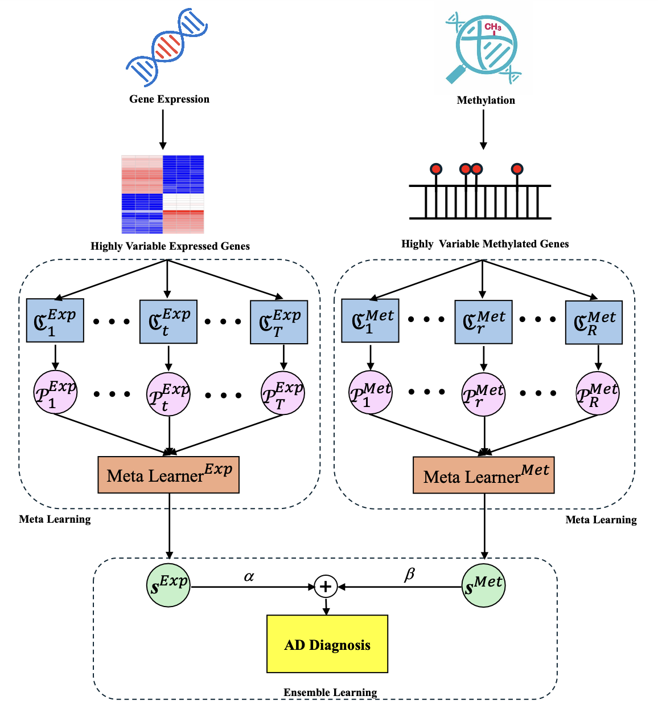

# WIMOAD: Stacking Ensemble and Weighted Multi-Omics Integration for Alzheimer’s Disease Diagnosis
**WIMOAD** a stacking ensemble and weighted integration of multi-omics data for AD diagnosis. WIMOAD synergistically leverages specialized classifiers for patients' paired gene expression and methylation data for multi-stage classification. The resulting scores of classifiers were then stacked for meta-learning performance improvement. The prediction results of two distinct meta-models were integrated with optimized weights for the final decision-making of the model, providing higher performance than using single omics only. In addition, WIMOAD also stands out as a biologically interpretable model by leveraging the SHapley Additive exPlanations (SHAP) to elucidate the contributions of each gene from each omics to the model output. 

## Table of Contents (Under construction)
- [Workflow](#workflow)
- [Installation](#installation)
- [Usage](#usage)
- [Contact](#contact)
- [Publication](#publication)

## Workflow


## Installation
1. Clone the WIMOAD git repository
```bash
git clone https://github.com/wan-mlab/WIMOAD.git
```
2. Create a new conda environment:
```bash
conda create -n wimoad python=3.9
conda activate wimoad
```
3. Deactivate the environment:
```bash
conda deactivate
```

## Usage
```bash
1. model_config.py: meta models, groups and base classifiers
2. runner.py: main section for generating the results after meta learning for each omics
3. Integration.ipynb: for weighted integration of omics after the meta learning
```

## Contact
If you have any questions, comments, or would like to report a bug, please contact haxiao@unmc.edu

## Publication
Xiao, H.; Wang, J.; Wan, S. WIMOAD: Weighted Integration of Multi-Omics data for Alzheimer’s Disease (AD) Diagnosis. bioRxiv 2024.09.25.614862, https://www.biorxiv.org/content/10.1101/2024.09.25.614862v1